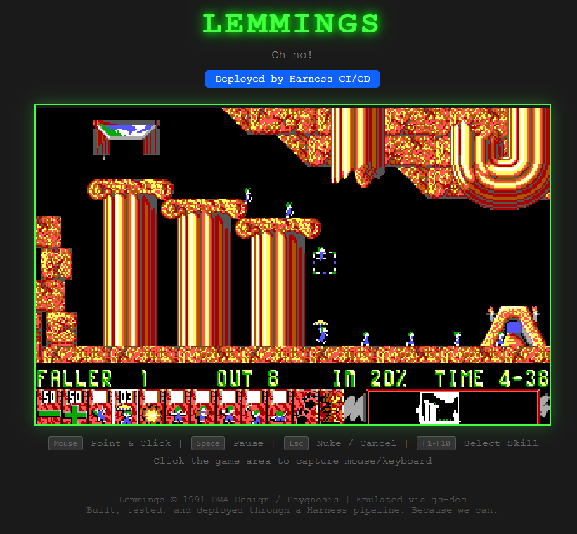

# Lemmings - Deployed by Harness

<p align="center">
  
</p>

> "Will it run Lemmings?" — Every engineer, at every company, since 1993.

Yes. Yes it will. This repo deploys a fully playable Lemmings (1993 shareware) to a Kubernetes cluster using a [Harness](https://harness.io) CI/CD pipeline.

The container packages the original Lemmings shareware in a browser-playable format (via [js-dos](https://js-dos.com)) served by nginx. The Harness pipeline builds the container, pushes it to a registry, deploys to dev, runs a smoke test, gates on manual approval, and promotes to prod.

```
commit → build container → push to registry → deploy to dev → smoke test → approval gate → deploy to prod
                                                                                    ↑
                                                                          (you approve Lemmings for prod)
```

## Prerequisites

- A Kubernetes cluster (any: k3s, EKS, GKE, AKS, kind, minikube...)
- A [Harness](https://app.harness.io) account (free tier works)
- A Harness Delegate running in your cluster
- `kubectl`, `helm`, and `docker` (or equivalent) installed locally
- A container registry (Harness Artifact Registry, Docker Hub, ECR, etc.)

## Quick Start (Local)

If you just want to see Lemmings running locally without a pipeline:

```bash
# Build and deploy to your local cluster
./scripts/setup.sh

# Open in browser
open http://localhost:30666

# Tear it down when you're done
./scripts/teardown.sh
```

## Deploy via Harness Pipeline

### 1. Set up your Harness project

Create a project in Harness (or use an existing one). You'll need:
- A **Kubernetes connector** pointing to your cluster
- A **Docker Registry connector** pointing to your container registry
- A **code repo connector** pointing to this repo (GitHub, Harness Code, etc.)

### 2. Create the service

In your Harness project, create a Service with:
- **Deployment type:** Native Helm
- **Manifest source:** this repo, path `helm/harness-lemmings`
- **Artifact source:** your container registry, image path for `harness-lemmings`

### 3. Create environments and infrastructure

- **dev** environment → infrastructure definition pointing to your cluster + a `lemmings` namespace
- **prod** environment → infrastructure definition (same cluster, or a different one for realism)

### 4. Import the pipeline

Import `.harness/pipeline.yaml` into your project. Fill in the `<+input>` runtime inputs:
- Code repo connector
- Kubernetes infrastructure connector
- Docker registry connector
- Image repo path (e.g., `your-registry.io/harness-lemmings`)
- Infrastructure definition identifiers

### 5. Run it

Execute the pipeline. Watch it:
1. Clone this repo
2. Build the Lemmings container (first build ~5 min due to downloading shareware assets)
3. Push to your registry
4. Deploy to dev namespace
5. Smoke test (curls the health endpoint + verifies "Lemmings" in page)
6. Wait for your approval (the governance demo moment)
7. Deploy to prod

Then open `http://<node-ip>:30666` and play Lemmings.

## How It Works

```
app/
├── index.html      # Browser UI - loads js-dos, renders Lemmings
├── nginx.conf      # Web server config with /healthz endpoint
├── Dockerfile      # Multi-stage: downloads shareware → bundles → serves
└── .dockerignore

helm/harness-lemmings/  # Helm chart for k8s deployment
├── Chart.yaml
├── values.yaml
└── templates/

.harness/
└── pipeline.yaml   # Harness pipeline definition (parameterized)

scripts/
├── setup.sh        # Local deploy (no pipeline needed)
├── teardown.sh     # Clean removal
└── smoke-test.sh   # Validates the deployment works
```

The Dockerfile does the heavy lifting:
1. Downloads Lemmings shareware v1.9 (freely distributable, ~4MB WAD + EXE)
2. Creates a `.jsdos` bundle (DOSBox-in-WebAssembly game package)
3. Packages everything in an nginx container

At runtime, the browser loads js-dos from CDN, which emulates DOSBox in WebAssembly, and runs the original Lemmings.EXE with the shareware WAD. Full game, in a browser, deployed by a CI/CD pipeline.

## Customization

| Variable | Default | Description |
|----------|---------|-------------|
| `Lemmings_NAMESPACE` | `lemmings` | Kubernetes namespace |
| `Lemmings_RELEASE` | `harness-lemmings` | Helm release name |
| `Lemmings_IMAGE` | `harness-lemmings` | Container image name |
| `Lemmings_TAG` | `latest` | Image tag |

Override in your pipeline or local env:
```bash
Lemmings_NAMESPACE=lemmings-prod Lemmings_TAG=build-42 ./scripts/setup.sh
```

## Why?

Because every platform must answer the question. And because deploying a game from 1993 through a modern CI/CD pipeline with governance gates, smoke tests, and progressive delivery is genuinely funny — and also demonstrates every capability that matters:

- Container builds (multi-stage, external asset download)
- Artifact management (push/pull from registry)
- Helm-based deployment
- Health checks and smoke tests
- Approval gates (human-in-the-loop governance)
- Progressive delivery (dev → approval → prod)
- GitOps trigger (push to main → pipeline fires)

All for a 32-year-old game that runs in DOSBox emulated in WebAssembly served by nginx deployed by Helm orchestrated by Harness triggered by a git push.

## "But does it actually *run* Lemmings?"

Yes. For the pedants in the back: Harness doesn't just *deploy* Lemmings — it *runs* Lemmings.

`app/Dockerfile.runner` builds a headless container with [Chocolate Doom](https://www.chocolate-lemmings.org/) (a faithful source port). When executed as a Kubernetes Job on the same infrastructure managed by the Harness delegate, it processes Lemmings's built-in demo recording frame-by-frame:

```
timed 5026 gametics in 127 realtics (1385.118164 fps)
```

5,026 game frames rendered at 1,385 FPS on the delegate's cluster. The Lemmings engine initialized, loaded the WAD, ran the renderer, ticked the game logic, and completed — all orchestrated by Harness. No browser, no WebAssembly, no tricks. Native Lemmings binary, running on Harness compute.

So to be precise: Harness *deploys* playable Lemmings (the browser version) **and** *runs* Lemmings (the headless timedemo). Both definitions are satisfied. You're welcome.

## License

This repo's code is MIT licensed. Lemmings shareware is freely distributable per id Software's original terms. The shareware WAD and executable are downloaded at build time and not stored in this repository.

---

*Rip and tear, until it is done.* 🔥
